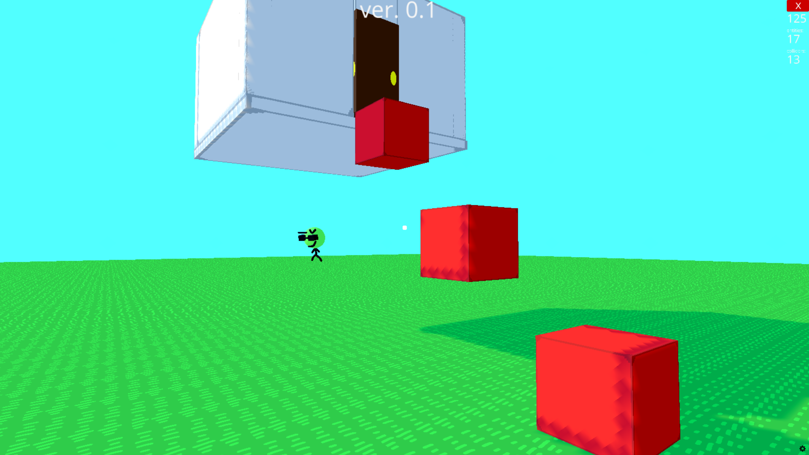
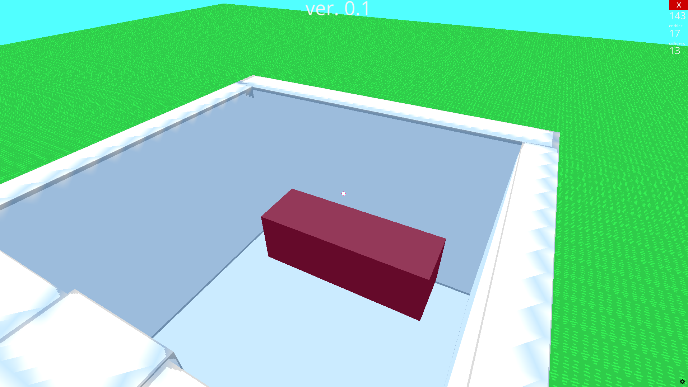
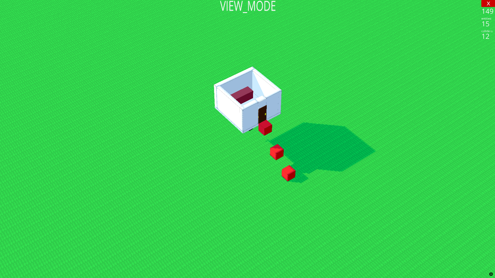

# 3D-Game
A simple game written in Python using the Ursina Engine library

<!--# Screenshots-->
<!--

-->

<!--# Links
- https://www.ursinaengine.org/
- https://github.com/pokepetter/ursina1-->

# License

Released under [***MIT*** *License*](SCREENSHOTS.md)

---

[Screenshots](LICENSE)

#### ***Thank you for your attention!***

